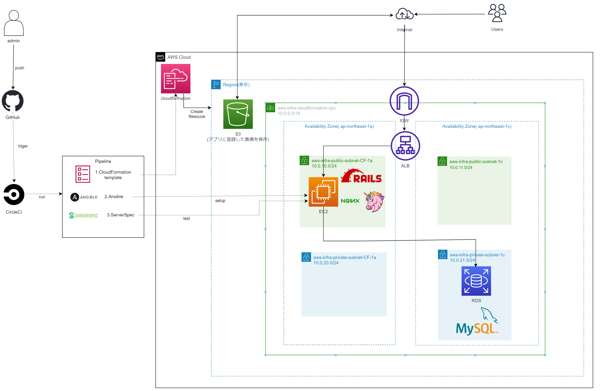
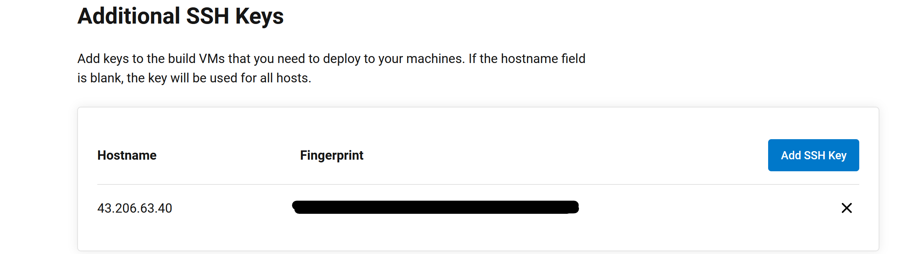

CircleCIでRailsアプリの自動デプロイ、テスト  
============  
# 概要
GitHubのリモートリポジトリへのpushをトリガーとして、CircleCIでアプリのデプロイ、テストを自動実行するリポジトリとなります。  
## アプリのデプロイ、テストの実行順序  

1. AWS CloudFormation Linterにてcloudformationフォルダ内のymlファイルを確認して、ソースコードに問題が無いか確認  
2. ymlファイルを読み取りCloudFormationがリソースを作成  
- 作成順    
  VPC→SG→EC2→RDS→ALB→RDS→ALB→S3の順序で作成    
3. Ansibleのplaybookに基づきCloudFormationで作成されたリソースをターゲットノードとしてアプリをデプロイ  
- playbookのroleの処理順序  
Git→package→ruby→mysql→appclone→bundler→nginx→appの順番で処理を実施  
4. Serverspecを使用してアプリのデプロイされたリソースに対して、sample_spec.rbにあるテストを実施  
- テストの内容  
1. gitインストール確認  
2. nginx起動確認  
3. unicorn起動確認  
4. ALBのDNSにアクセスしてWebページが表示される  
（レスポンスで200を返す）  
上記内容のテストを実施
## 使用ツール

- CricleCI  
- CloudFormation  
- Ansible  
- Serverspec  
## 動作環境
ruby_version: 3.1.2    
bundler_version: 2.3.14    
Rails: 7.0.4  
Node.js: 14.21.3  
yarn: 1.22.19  
imagemagic_ver: 7.1.1-8  
## 補足事項  
・CloudFormationのテンプレートは[第１０回課題](https://github.com/akitoc342/lecture/tree/main/cloudformationymlfile)で作成した物を一部訂正して流用  
(*S3のみ追加で作成)  
・デプロイ用のアプリは課題用に提供されている[サンプルアプリ](https://github.com/yuta-ushijima/raisetech-live8-sample-app)を使用

## AWS構成図
  

## CircleCI環境変数  
  
   